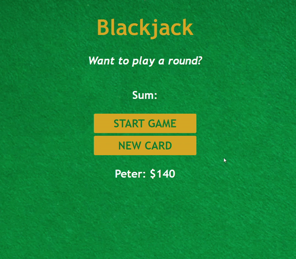

# blackjack-JS
<h2>Blackjack game using vanilla JS and CSS.</h2>

<a href="https://peus-blackjack-js.netlify.app/">
-->Link<--</a> para jogar!
 
    
<h3>Descrição</h3>

Para manter a probabilidade real do jogo, foi adicionado o método generateDeck() que retorna um array contendo 52 objetos distintos do tipo card, cada um representando uma carta real do baralho.

Cada objeto card contém:  <strong>cartas</strong> = { <strong>naipe</strong>: Copas <strong>string do valor</strong>: 'K' <strong>valor</strong>: 10 <strong>nome</strong>: 'KC' <strong>icone</strong>: bi bi-heart-fill }

  
  
 

