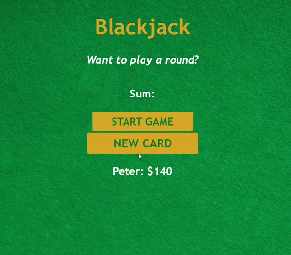

# blackjack-JS
<h2>Blackjack game using vanilla JS and CSS.</h2>

Para jogar basta clonar o repo e executar o index.html em algum server

To play you'll need to clone the repo e start index.html in some server

The game uses a implementation of a deck array with 52 cards objects, so the cards don't repeat themselfs.
